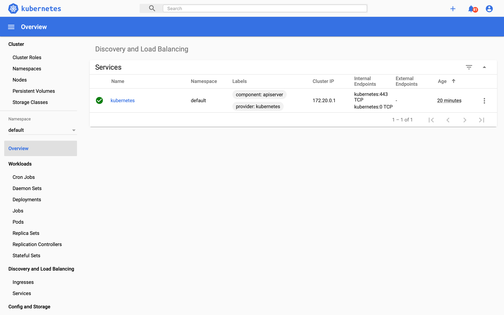

# Deploy-An-EKS-Cluster-Using-Terraform
## Provision an EKS Cluster (AWS)

### OBJECTIVE:

By the end of this project, you will be able to deploy an EKS cluster using Terraform. In addition, you will be able to configure kubectl using Terraform output to deploy a Kubernetes dashboard on the cluster.

### PREREQUISITES:

For this tutorial, you will need:

* an [AWS account](https://aws.amazon.com/console/) with the IAM permissions listed on the EKS module documentation,

* a configured AWS CLI

* AWS IAM Authenticator

* ***kubectl***


* Download Terraform [here](https://www.terraform.io/downloads/) .

According to [HashiCorp](https://www.terraform.io), Terraform is an open-source infrastructure as code software tool that provides a consistent CLI workflow to manage hundreds of cloud services. Terraform codifies cloud APIs into declarative configuration files.

* Download [Wget](https://code2care.org/macos/wget-command-macos-terminal) .

According to [Hostinger Tutorials](https://www.hostinger.com/tutorials/wget-command-examples/) ,
Wget is a computer tool created by the GNU Project. You can use it to retrieve content and files from various web servers. The name is a combination of World Wide Web and the word get. It supports downloads via FTP, SFTP, HTTP, and HTTPS.
Wget is created in portable C and usable on any Unix system. It’s also possible to implement on Mac OS X, Microsoft Windows, AmigaOS, and other popular platforms.

### Why deploy with Terraform?

While you could use the built-in AWS provisioning processes (UI, CLI, CloudFormation) for EKS clusters, Terraform provides you with several benefits:

* **Unified Workflow** - If you are already deploying infrastructure to AWS with Terraform, your EKS cluster can fit into that workflow. You can also deploy applications into your EKS cluster using Terraform.

* **Full Lifecycle Management** - Terraform doesn't only create resources, it updates, and deletes tracked resources without requiring you to inspect the API to identify those resources.

* **Graph of Relationships** - Terraform understands dependency relationships between resources. For example, if an AWS Kubernetes cluster needs a specific VPC and subnet configurations, Terraform won't attempt to create the cluster if the VPC and subnets failed to create with the proper configuration.

### Step 1:

Use the package manager homebrew to install the AWS CLI.


``` 
$ brew install awscli 
```
After you've installed the AWS CLI, configure it by running aws configure.

When prompted, enter your AWS Access Key ID, Secret Access Key, region and output format.

```
$ aws configure
```


### Step 2: Set up and initialize your Terraform workspace


In your terminal, clone the following repository. It contains the example configuration used in this tutorial.

```
$ git clone https://github.com/hashicorp/learn-terraform-provision-eks-cluster
```
You can explore this repository by changing directories or navigating in your UI.

```
$ cd learn-terraform-provision-eks-cluster
```
In here, you will find six files used to provision a VPC, security groups and an EKS cluster. The final product should be similar to this:


1. **vpc.tf** provisions a VPC, subnets and availability zones using the **AWS VPC Module**. A new VPC is created for this tutorial so it doesn't impact your existing cloud environment and resources.

2. **security-groups.tf** provisions the security groups used by the EKS cluster.

3. **eks-cluster.tf** provisions all the resources (AutoScaling Groups, etc...) required to set up an EKS cluster using the **AWS EKS Module**.

On **line 14**, the AutoScaling group configuration contains three nodes.


4. **outputs.tf** defines the output configuration.

5. **versions.tf** sets the Terraform version to at least 0.14. It also sets versions for the providers used in this sample.

### Step 3: Initialize Terraform workspace

Once you have cloned the repository, initialize your Terraform workspace, which will download and configure the providers.

```
$ terraform init
```


### Step 4: Provision the EKS cluster


In your initialized directory, run terraform apply and review the planned actions. Your terminal output should indicate the plan is running and what resources will be created.

```
$ terraform apply
```


This terraform apply will provision a total of 53 resources (VPC, Security Groups, AutoScaling Groups, EKS Cluster, etc...). Confirm the apply with a yes.

This process should take approximately 10 minutes. Upon successful application, your terminal prints the outputs defined in outputs.tf.

### Step 5: Configure kubectl

Now that you've provisioned your EKS cluster, you need to configure kubectl.

Run the following command to retrieve the access credentials for your cluster and automatically configure kubectl.

```
$ aws eks --region $(terraform output -raw region) update-kubeconfig --name $(terraform output -raw cluster_name)
```
The Kubernetes cluster name and region correspond to the output variables showed after the successful Terraform run.


### Step 6: Deploy and access Kubernetes Dashboard

To verify that your cluster is configured correctly and running, you will deploy the Kubernetes dashboard and navigate to it in your local browser.

While you can deploy the Kubernetes metrics server and dashboard using Terraform, kubectl is used in this tutorial so you don't need to configure your Terraform Kubernetes Provider.

### * Deploy Kubernetes Metrics Server


The Kubernetes Metrics Server, used to gather metrics such as cluster CPU and memory usage over time, is not deployed by default in EKS clusters.

Download and unzip the metrics server by running the following command.

```
$ wget -O v0.3.6.tar.gz https://codeload.github.com/kubernetes-sigs/metrics-server/tar.gz/v0.3.6 && tar -xzf v0.3.6.tar.gz
```
Deploy the metrics server to the cluster by running the following command.

```
$ kubectl apply -f metrics-server-0.3.6/deploy/1.8+/
```
Verify that the metrics server has been deployed. If successful, you should see something like this.

```
$ kubectl get deployment metrics-server -n kube-system
```


### * Deploy Kubernetes Dashboard

The following command will schedule the resources necessary for the dashboard.

``` 
$ kubectl apply -f https://raw.githubusercontent.com/kubernetes/dashboard/v2.0.0-beta8/aio/deploy/recommended.yaml
```


Now, create a proxy server that will allow you to navigate to the dashboard from the browser on your local machine. This will continue running until you stop the process by pressing CTRL + C.


```
$ kubectl proxy
```


You should be able to access the Kubernetes dashboard [here](http://127.0.0.1:8001/api/v1/namespaces/kubernetes-dashboard/services/https:kubernetes-dashboard:/proxy/).


### * Authenticate the dashboard

To use the Kubernetes dashboard, you need to create a ClusterRoleBinding and provide an authorization token. This gives the cluster-admin permission to access the kubernetes-dashboard. Authenticating using kubeconfig is not an option. You can read more about it in the Kubernetes documentation.

In another terminal (do not close the kubectl proxy process), create the ClusterRoleBinding resource.

```
$ kubectl apply -f https://raw.githubusercontent.com/hashicorp/learn-terraform-provision-eks-cluster/main/kubernetes-dashboard-admin.rbac.yaml
```

Then, generate the authorization token.
```
$ kubectl -n kube-system describe secret $(kubectl -n kube-system get secret | grep service-controller-token | awk '{print $1}')
```


Select "Token" on the Dashboard UI then copy and paste the entire token you receive into the dashboard authentication screen to sign in. You are now signed in to the dashboard for your Kubernetes cluster.

Navigate to the "Cluster" page by clicking on "Cluster" in the left navigation bar. You should see a list of nodes in your cluster.



### * Clean up your workspace

Congratulations, you have provisioned an EKS cluster, configured kubectl, and deployed the Kubernetes dashboard.

To destroy any resources you create once you are done with this tutorial. Run the destroy command and confirm with yes in your terminal.

```
$ terraform destroy
```


